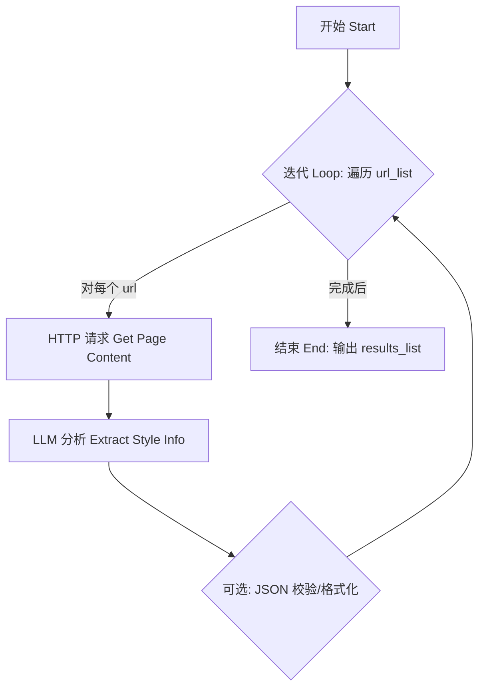

# Dify 工作流设计：风格画像分析 Flow

## 1. 目标

该 Flow 旨在接收用户提供的一个或多个文章 URL，通过 AI 分析每篇文章的内容，提取作者信息、文体特征和样例文本，最终输出一个包含所有分析结果的列表。

## 2. Flow 结构



## 3. 节点详解

### 3.1 开始节点 (Start Node)

* 输入变量:
  * `url_list`: `List<String>` - 用户提供的 URL 列表。

* 备选方案 (处理长 URL 或简化输入):
  * 输入变量: 定义一个 `urls_text` 变量，类型为“段落 (Paragraph)”。用户运行时在此输入多个 URL，每个 URL 占一行。
  * 后续节点: 在“开始节点”后添加一个“参数提取器 (Parameter Extractor)”节点。
    * 输入: `urls_text`。
    * 配置: 使用“换行符” (`\n`) 作为分隔符进行提取，或者使用 URL 正则表达式。
    * 输出: 一个名为 `extracted_url_list` 的 `List<String>` 变量，包含所有提取到的 URL。
  * 迭代节点输入: 后续的“迭代节点”应使用 `extracted_url_list` 作为输入。

### 3.2 迭代节点 (Iteration/Loop Node)

* 作用: 遍历 `url_list` 中的每一个 `url`。
* 输入: `url_list`。
* 循环变量: `current_url` (当前正在处理的 URL)。
* 循环体: 对每个 `current_url` 执行以下子流程。
* 输出: `analysis_results_list`: `List<JSON>` - 收集每次循环产生的 JSON 分析结果。

### 3.3 HTTP 请求节点 (HTTP Request Node - 循环体内)

* 作用: 获取 `current_url` 的网页内容。
* 输入: `current_url`。
* 输出: `page_content`: `String` (HTML 或提取后的文本)。
* 注意事项:
  * 需要配置错误处理（超时、404 等）。
  * 考虑 JS 渲染问题，Dify 内置工具可能不足，必要时需预处理或使用外部服务。
  * 优先提取核心文章内容，避免导航、广告等干扰。

### 3.4 LLM 分析节点 (LLM Node - 循环体内)

* 目标与作用: 接收上一步获取的网页文本内容 (`page_content`)，利用 LLM 的理解能力提取结构化的作者信息、写作风格特征及样例文本，并按照预定义的 JSON 格式输出。

* 输入:
  * 主要输入: `page_content`: `String` (来自 HTTP 请求节点的输出，需在 Dify 中配置引用，例如 `{{http_request_node_id.page_content}}`)。
  * 隐式输入 (Prompt 中使用): `current_url`: `String` (来自外层迭代节点，用于填充输出 JSON 中的 `source_url` 字段)。

* **User Prompt:**

请分析以下文章内容：
{{page_content}}

请专注于提取核心信息。根据文章内容，将作者的核心特征和文章的核心文体风格总结为**关键要点的列表 (bullet points)**，并选取 1-3 段最能体现作者风格的原文片段。

**极其重要：** 你必须严格按照以下 JSON 结构和指定的键名返回分析结果。请务必参考提供的 JSON Schema 以确保完全匹配。

{
  "source_url": "{{current_url}}", // 必须包含此键，值为文章 URL 字符串
  "author_profile": { // **必须**使用 "author_profile" 作为键名
    "name": "...", // 作者姓名或可识别称呼，若无则为 null
    "summary": [ // **必须**使用 "summary" 作为键名，值为**字符串数组**，包含作者核心特征的关键要点列表
        "要点1: 例如，专注于SaaS和AI技术",
        "要点2: 例如，常以第一人称分享经验",
        "要点3: 例如，强调技术创新与业务应用"
    ],
    "links": ["..."] // 值为相关链接的**字符串数组**，若无则为 []
  },
  "style_summary": [ // **必须**使用 "style_summary" 作为键名，值为**字符串数组**，包含文章核心风格特点的关键要点列表
      "要点1: 例如，专业详细的技术说明为主",
      "要点2: 例如，语调积极且富有启发性",
      "要点3: 例如，结构清晰，分段易于理解",
      "要点4: 例如，用词精准，结合案例和数据"
  ],
  "sample_texts": [ // **必须**使用 "sample_texts" 作为键名
    "原文片段1...", // **必须**是包含 1-3 个原文片段的**字符串数组**
    "原文片段2...",
    "..."
  ]
}

请再次确认，你的输出是**严格符合上述结构和键名**的、**完整且有效**的 JSON。**绝对不要**在顶层添加任何额外的包裹键（如 "structured_output"）。

  * 模型选择:
    * 根据任务复杂度和预算选择合适的 LLM（如 GPT-4, Claude 3 Opus/Sonnet 等能力更强的模型通常效果更好）。

* 输出变量:
  * 定义输出变量名为 `analysis_result_json` (类型: `String`)，用于存储包含分析结果的 JSON 字符串。

* Dify 配置步骤总结:
  1. 在迭代循环体内添加 LLM 节点。
  2. 选择模型。
  3. 配置 Prompt（粘贴上述设计好的 Prompt）。
  4. 设置输入变量，引用 HTTP 节点的 `page_content`。
  5. 定义输出变量为 `analysis_result_json`。
  6. **重要:** 回到迭代节点设置，将“要收集的值”配置为引用此 LLM 节点的 `analysis_result_json` 输出 (例如 `{{llm_analyzer_1.analysis_result_json}}`)。

### 3.5 JSON 校验/格式化节点 (Code/Utilities Node - 可选，循环体内)

* 作用: 确保 LLM 输出的是有效的 JSON。
* 输入: `analysis_result_json`。
* 输出: 验证/格式化后的 JSON 字符串或对象。

### 3.6 结束节点 (End Node)

* 作用: 输出整个 Flow 的最终结果。
* 输出: `analysis_results_list`: `List<JSON>` - 包含所有 URL 分析结果的列表。

## 4. 关键考量

* 网页抓取质量: 这是整个流程的基础，需要保证能稳定获取到有效的文章内容。
* Prompt 工程: LLM 节点的 Prompt 需要反复调试，以确保提取信息的准确性和完整性，以及 JSON 格式的稳定性。
* 错误处理: 在 HTTP 请求、LLM 调用等步骤都需要考虑异常情况的处理。
* 结果整合: Flow 输出的是独立的分析结果列表，最终的画像整合需要在后端服务或前端界面完成，或者通过增加后续的聚合 LLM 节点实现。
* 成本与性能: 处理多个 URL 会增加 API 调用次数和执行时间。

```json
{
  "type": "object",
  "title": "核心网页内容风格分析",
  "description": "从网页文章中提取的核心作者信息、文体特征及样例文本。",
  "properties": {
    "source_url": {
      "type": "string",
      "format": "uri",
      "description": "被分析文章的原始 URL。"
    },
    "author_profile": {
      "type": "object",
      "description": "核心作者信息。",
      "properties": {
        "name": {
          "type": ["string", "null"],
          "description": "作者姓名或可识别的称呼。如果无法提取，则为 null。"
        },
        "summary": {
          "type": "string",
          "description": "一段简洁的文字，总结作者的核心特征 (基于文章内容提炼，类似截图中'著者情報'要点)。"
        },
         "links": {
          "type": "array",
          "description": "与作者相关的链接列表。如果无法提取，则为空数组 []。",
          "items": {
            "type": "string",
            "format": "uri"
          }
        }
      },
      "required": ["name", "summary", "links"]
    },
    "style_summary": {
       "type": "string",
       "description": "一段简洁的文字，总结文章的核心文体特征 (基于文章内容提炼，类似截图中'文体の特徴'要点)。"
    },
    "sample_texts": {
      "type": "array",
      "description": "1-3段最能体现作者风格的原文片段列表。",
      "items": {
        "type": "string"
      },
      "minItems": 1,
      "maxItems": 3
    }
  },
  "required": [
    "source_url",
    "author_profile",
    "style_summary",
    "sample_texts"
  ]
}
